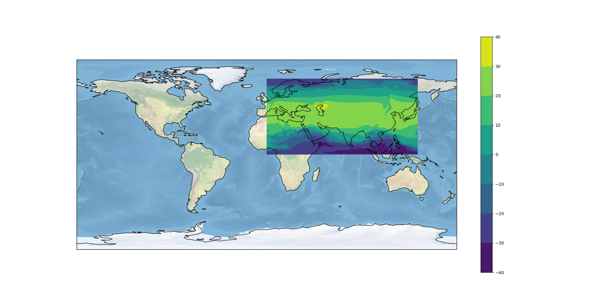

.. _plotter:

Writing a simple Plot Function
=================================

Prepare
-------

See :ref:`prepare`.

Activate the Conda workshop enviroment::

    $ source activate workshop

Aim
---

We are going to write a simple plot function in Python using *matplotlib* and *cartopy*.

Objectives:

* You will learn how to install packages with Conda.
* You will learn the basic usage of the *netCDF*, *matplotlib* and *cartopy* Python libraries.

Run the plotter
---------------

Go to the plotter tutorial source:

.. code-block:: bash

    $ cd ~/birdhouse-workshop/tutorials/01_plotter

Try the plotter Python module:

.. code-block:: bash

    $ python plotter.py
    Traceback (most recent call last):
    File "plotter.py", line 1, in <module>
      import matplotlib.pylab as plt
    ModuleNotFoundError: No module named 'matplotlib'

Oops, something is missing ... please install the ``matplotlib`` package via Conda:

.. code-block:: bash

    # Let's see what is available
    $ conda search -c conda-forge matplotlib

    # ... and install it from the conda-forge channel
    $ conda install -c conda-forge matplotlib

Conda will show you a list of packages, which are going to be installed.
Have a look at this list and answer with ``y`` or just press ``enter``.

.. code-block:: bash

  The following NEW packages will be INSTALLED:

  matplotlib:       2.0.2-py36_2  conda-forge

  Proceed ([y]/n)?

We should check now the ``plotter.py`` source code.
Open the ``plotter.py`` in your favorite editor, some people like ``vim``:

.. code-block:: bash

    $ vim plotter.py

Besides ``matplotlib`` there is another ``import`` for ``netCDF4``:

.. code-block:: python

  from netCDF4 import Dataset

Let us install ``netcdf4``:

.. code-block:: bash

    # same procedure as above ...
    $ conda search -c conda-forge netcdf4
    $ conda install -c conda-forge netcdf4

So, we should now be ready to run the plotter:

.. code-block:: bash

    $ python plotter.py
    Plotting ../data/air.mon.ltm.nc ...
    Plot written to plot.png

A plot was generated. Open it in your favorite image viewer.
On Ubuntu/LinuxMint you can try *Eye of Gnome*:

.. code-block:: bash

    $ eog plot.png

The image should look like the following:

.. image:: ../_static/plot.png

Exercise
--------

Open the ``plotter.py`` and implement the following features:

* add a colorbar
* add a background map with coastlines
* use a PlateCarree map projection

You will need an additional Python package, ``cartopy``, which you can install with conda.
This package is available on the conda-forge channel.
You need to provide an option with the conda channel:

.. code-block:: bash

    $ conda install -c conda-forge mypackage

Read the code and comments carefully to make this work.

The final result should look like this:

Links
-----

* Matplotlib: http://matplotlib.org/
* Cartopy: http://scitools.org.uk/cartopy/
* `Using cartopy with matplotlib <http://scitools.org.uk/cartopy/docs/latest/matplotlib/intro.html>`_
* `GeoScience Notebook <https://github.com/koldunovn/python_for_geosciences/blob/master/07%20-%20Other%20modules%20for%20geoscientists.ipynb>`_
* `PyEarthScience: matplotlib examples <https://github.com/KMFleischer/PyEarthScience/>`_
