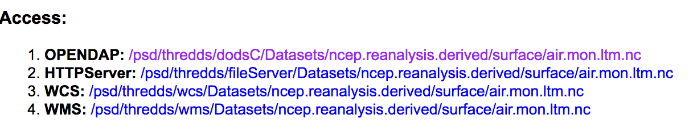
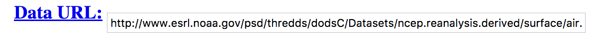

.. _plotter_cli:

Adding a Command-Line Interface
===============================

Prepare
-------

See :ref:`prepare`.

Activate the Conda workshop enviroment:

.. code-block:: bash

    $ source activate workshop

Aim
---

We are going to write a command line interface (CLI) for our Python plot function.

Objectives:

* You will learn how to write a CLI with the Python library `argparse <https://docs.python.org/3/library/argparse.html>`_.

Run the plotter CLI
-------------------

Go to the plotter tutorial source:

.. code-block:: bash

    $ cd ~/birdhouse-workshop/tutorials/03_plotter_cli

See the command line options of our plotter:

.. code-block:: bash

    $ python plotter.py -h
    usage: plotter.py [-h] [-V [VARIABLE]] dataset

Plot our well-know image:

.. code-block:: bash

    $ python plotter.py --variable air ../../data/air.mon.ltm.nc

Exercise 1
-----------

Play a little bit with the command-line options. Try some other options (``-V``),
use invalid input (water) and skip some arguments.

Excercise 2
-----------

Use external data from a Thredds service, like NOAA:

https://www.esrl.noaa.gov/psd/thredds/catalog/Datasets/ncep.reanalysis.derived/surface/catalog.html

See access methods for a dataset, note *OpenDAP*:

https://www.esrl.noaa.gov/psd/thredds/catalog/Datasets/ncep.reanalysis.derived/surface/catalog.html?dataset=Datasets/ncep.reanalysis.derived/surface/air.mon.ltm.nc

Use *OpenDAP* URLs directly as dataset input:

http://www.esrl.noaa.gov/psd/thredds/dodsC/Datasets/ncep.reanalysis.derived/surface/air.mon.ltm.nc

.. code-block:: bash

    $ python plotter.py --variable air \
          http://www.esrl.noaa.gov/psd/thredds/dodsC/Datasets/ncep.reanalysis.derived/surface/air.mon.ltm.nc

Exercise 3
----------

.. todo::
  Fix projection or add another parameter, e.a show colorbar.

Extend the command line and the plot function with an optional parameter for
the map projection.

Open your editor on ``plotter.py`` ... and happy hacking.

Don't forget to test often:

.. code-block:: bash

  $ pytest plotter.py

Links
-----

* `Python argparse <https://docs.python.org/3/howto/argparse.html>`_
* `NOAA Thredds Data Service <https://www.esrl.noaa.gov/psd/thredds/catalog.html>`_
