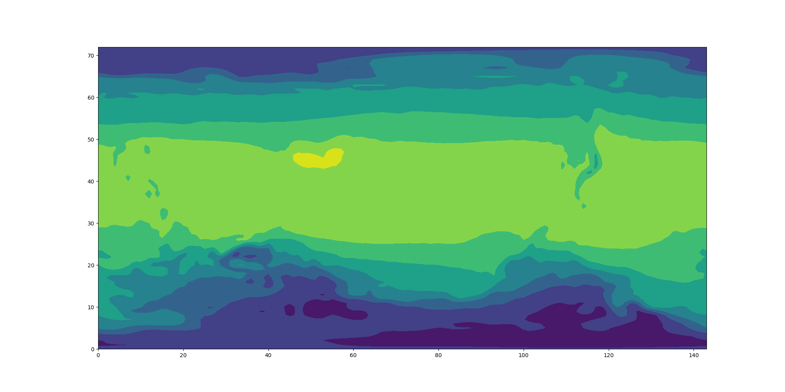

.. _plotter:

Plotter
=======

Prepare
-------

Clone the workshop repo from Github::

    $ git clone https://github.com/bird-house/birdhouse-workshop.git

Create the workshop conda envionment::

    $ conda create -n workshop python=3

Activate the conda workshop enviroment::

    $ source activate workshop

Aim
---

We are going to write a simple plot function using matplotlib and cartopy.

Objectives:

* You will learn how to install packages with conda.
* You will learn the basic usage of the NetCDF, matplotlib and cartopy Python libraries.

Run the plotter
---------------

Go to the plotter tutorial source::

    $ cd birdhouse-workshop/tutorials/01_plotter

Try the plotter python module::

    $ python plotter.py
    Traceback (most recent call last):
    File "plotter.py", line 1, in <module>
      import matplotlib.pylab as plt
    ModuleNotFoundError: No module named 'matplotlib'

Oops, something is missing ... please install the ``matplotlib`` package via conda::

    # Let's see what is available
    $ conda search matplotlib

    # ... and install it
    $ conda install matplotlib

Conda will show you a list of packages, which are going to be installed.
Have a look at this list and answer with ``y`` or just press ``enter``.

We should check now the ``plotter.py`` source code.
Open the ``plotter.py`` in your favorite editor, some people like ``vim``::

    $ vim plotter.py

Besides ``matplotlib`` there is another ``import`` for ``netCDF4``.
Let us install it::

    # same procedure as above ...
    $ conda search netcdf4
    $ conda install netcdf4

So, we should now be ready to run the plotter::

    $ python plotter.py
    Plotting ../data/air.mon.ltm.nc ...
    Plot written to plot.png

A plot was generated. Open it in your favorite image viewer.
On Ubuntu/LinuxMint you can try *Eye of Gnome*::

    $ eog plot.png

The image should look like the following:

