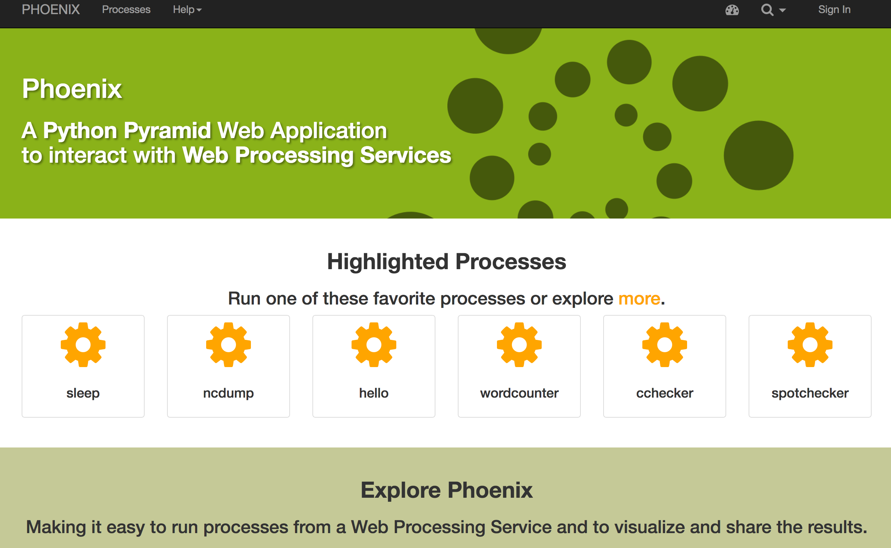

.. _pywps_clients:

Clients
=======

Requirements
------------

See :ref:`prepare`.

Activate the conda workshop enviroment:

.. code-block:: bash

    $ source activate workshop

Aim
---

We are going to use a WPS client.

Objectives:

* You will learn how to use WPS clients.

Birdy
-----

`Birdy`_ is a command-line client for Web Processing Services.

Install it via conda:

.. code-block:: bash

    $ conda install -c birdhouse -c conda-forge birdhouse-birdy

Start the demo WPS service:

.. code-block:: bash

    # go to the workshop root folder
    $ cd ~/birdhouse-workshop/
    # start wps service
    $ python demo/demo.py

.. warning::
  The WPS service is running in *foreground*. You need to
  open a new terminal and activate the conda *workshop* environment
  for the *birdy* WPS client.

.. tip::
  You can also start the WPS service in *background*:

    ``$ python demo/demo.py -d``

  Remember the process id to kill the service:

    ``forked process id: 16483``

Let birdy know the WPS service URL:

.. code-block:: bash

    $ export WPS_SERVICE=http://localhost:5000/wps

See which processes are available:

.. code-block:: bash

    $ birdy -h
    usage: birdy [<options>] <command> [<args>]

Show the description of ``say_hello``:

.. code-block:: bash

    $ birdy say_hello -h
    usage: birdy say_hello [-h] --name [NAME]
                       [--output [{response} [{response} ...]]]

Run ``say_hello``:

.. code-block:: bash

    $ birdy say_hello --name Birdy
    [ProcessAccepted 0/100] PyWPS Process say_hello accepted
    [ProcessSucceeded 0/100] PyWPS Process Process Say Hello finished
    Output:
    response=Hello Birdy

Phoenix
-------

`Phoenix`_ is `Pyramid`_ web-application to interact with WPS services.

You can try the online `demo`_.

Exercise 1
----------

Play with birdy ... run the ``sleep`` process.

Exercise 2
-----------

Start the demo service with the processes from :ref:`pywps_testing` and call
the ``simple_plot`` process with **birdy**.

Exercise 3
----------

Try some of the processes on the Phoenix `demo`_. For example the
**wordcounter** and the **spotchecker**.

Links
-----

* `Birdy`_
* `Phoenix`_
* `Pyramid`_

.. _Birdy: http://birdy.readthedocs.io/en/latest/
.. _Phoenix: http://pyramid-phoenix.readthedocs.io/en/latest/
.. _Pyramid: https://trypyramid.com/
.. _demo: https://mouflon.dkrz.de/
