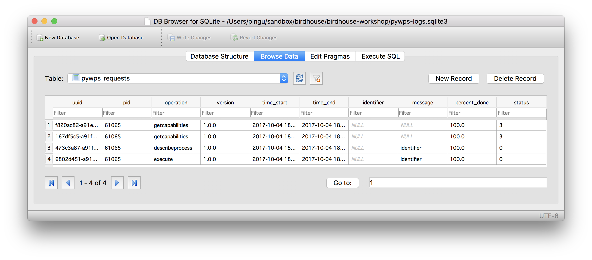

.. _pywps_logging:

Logging
=======

Requirements
------------

See :ref:`prepare`.

Activate the conda workshop enviroment:

.. code-block:: bash

    $ source activate workshop

Aim
---

Take a look at the `Logging section <http://pywps.readthedocs.io/en/latest/configuration.html#logging>`_
in the configuration file. PyWPS currently logs events to two different locations:

* A log file where messages are stored. The kind of messages is set in the configuration file.
* A database where each request to the service is registered.

PyWPS uses `SQLAlchemy <http://www.sqlalchemy.org/>`_ to connect and work with multiple database management systems.
SQLite and PostgreSQL tend to be the most used options.

Objectives:

* You will learn how to configure and check the logs.

Check the logs
--------------

Our demo WPS service is configured to log to the ``pywps.log`` file.
Using the ``tail``, ``less`` or ``cat`` commands search for error messages
in the ``pywps.log`` file.

.. tip::
    These messages are preceded by the string "[ERROR]", it is possible to grep the error messages::

      cat pywps.log | grep "\[ERROR\]"

Continuous monitoring
---------------------

Use the tail command to continuously monitor the activity of the service:

.. code-block:: bash

    $ tail -f pywps.log

Database browser
----------------

If you have no database browsing programme installed,
Install `DB Browser for SQLite <http://sqlitebrowser.org/>`_ on your system.
On Debian based systems it can be installed from the command line:

.. code-block:: bash

    $ sudo apt install sqlitebrowser

See a screenshot with an open SQLite database file ``pywps-logs.sqlite3``:

You can also use SQLite on the command-line:

.. code-block:: bash

  $ sqlite3 pywps-logs.sqlite3
  sqlite> select * from pywps_requests;
  sqlite> .quit

Configure logging
-----------------

Change into the tutorials folder ``pywps_logging``:

.. code-block:: bash

    $ cd ~/birdhouse-workshop/tutorials/12_pywps_logging

It contains a ``pywps.cfg`` file with a logging section.
You can overwrite the default PyWPS configration by starting the PyWPS service
with another config:

.. code-block:: bash

    $ python ../../demo/demo.py -c pywps.cfg
    loading configuration
    Configuration file(s) ['../../demo/default.cfg', 'pywps.cfg'] loaded

Exercise 1
----------

Edit the ``pywps.cfg`` ... use ``DEBUG`` logging level.
Start the demo WPS service and monitor the log file.

Run a few processes.

Exercse 2
---------

Start the demo WPS service with processes form the previous tutorial.
Add some ``logging`` statements and monitor the service.

Links
-----

* `PyWPS workshop <https://github.com/PyWPS/pywps-workshop/blob/master/04-Logging.md>`_
