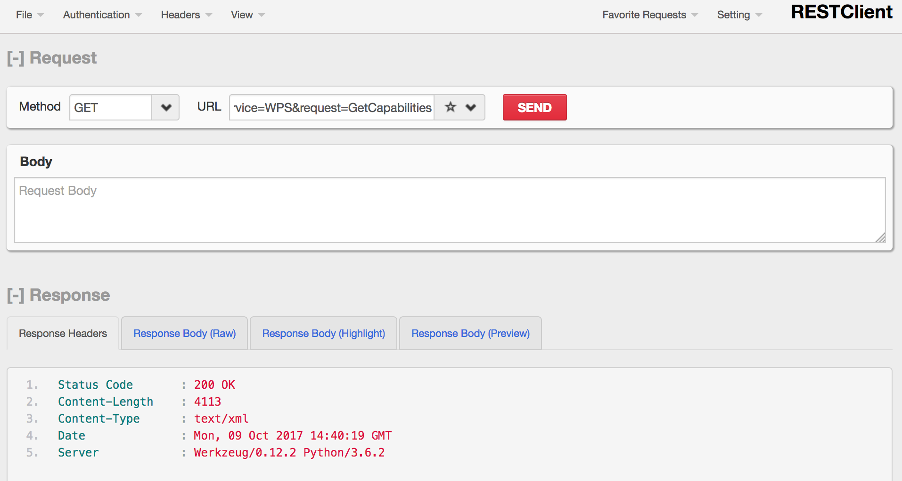

.. _pywps_testing:

Testing
=======

Requirements
------------

See :ref:`prepare`.

Activate the conda workshop enviroment:

.. code-block:: bash

    $ source activate workshop

Aim
---

As you develop more complex process and use more structured datasets,
using simply a web browser to test becomes impractical.
In this chapter you get acquainted with alternative tools to interact with a PyWPS instance.

Objectives:

* You will learn how to test a PyWPS process.

wget
----

Start by trying the *GetCapabilities* request:

.. code-block:: bash

    $ wget -q -O caps.xml \
      "http://127.0.0.1:5000/wps?service=WPS&request=GetCapabilities"

Important question: Why ``-q``, ``-O`` and ``"`` in the comnand:

``-q``
  quit verbose information about requests.
``-O``
  Output to file. You can use ``-``, and the content will be dumped into the prompt.
``"``
  Otherwise wget would not consider ``&`` as part of the URL and would cut it.

curl
----

Similar to *wget* you can also use *curl* to retrieve the *GetCapabilities* XML document:

.. code-block:: bash

  $ curl -s -o caps.xml \
    "http://127.0.0.1:5000/wps?service=WPS&request=GetCapabilities"

``-s``
    silent mode ... no progress bar.
``-o``
  Output to file. You can use ``-``, and the content will be dumped into the prompt.

RESTClient (Firefox only)
-------------------------

You can use the `RestClient`_ Firefox plugin to run requests.

Here is an example with a **GetCapabilities** request using HTTP method **GET**:

XML HTTP Post Request
---------------------

As requests and data become more structure and lengthy, concatenating all
parameters into a URL for a GET type request becomes difficult or impossible.
For this reason the WPS standard allows the definition of requests as XML documents
sent to the server using the POST method of the HTTP protocol.

Here is an example with an **Execute** request using HTTP method **POST**:

.. image:: ../_static/rest-client-post.png

It is also possible to use curl (or wget) for POST requests:

Exceptions
----------

*ExceptionReport* is an important feature of WPS. In WPS 1.0.0 we have the following exceptions:

**MissingParameterValue**
  The request does not include a parameter value or a default cannot be found.

**InvalidParameterValue**
  The request contains an invalid parameter value.

**NoApplicableCode**
  Generic exception, no other code could be applied.

**NotEnoughStorage**
  The server does not have enough space available.

Try the following request:

http://127.0.0.1:5000/wps?service=WPS&request=DescribeProcess

The exception is *MissingParameterValue*:

.. code-block:: xml

  <?xml version="1.0" encoding="UTF-8"?>
  <ows:ExceptionReport xmlns:ows="http://www.opengis.net/ows/1.1" xmlns:xsi="http://www.w3.org/2001/XMLSchema-instance" xsi:schemaLocation="http://www.opengis.net/ows/1.1 http://schemas.opengis.net/ows/1.1.0/owsExceptionReport.xsd" version="1.0.0">
  <ows:Exception exceptionCode="MissingParameterValue" locator="version" >
    <ows:ExceptionText>Missing version</ows:ExceptionText>
  </ows:Exception>
  </ows:ExceptionReport>

The *version* parameter is missing.

In case of Python errors in the called process, PyWPS will dump the Python stack into the *ExceptionReport*.

Exercise
--------

Try ``wget`` or ``curl`` with some of the previouse *DescribeProcess* and *Execute* requests.

Links
-----

* `RestClient <http://restclient.net/>`_
* `Poster on Chrome <https://chrome.google.com/webstore/detail/chrome-poster/cdjfedloinmbppobahmonnjigpmlajcd>`_
* `PyWPS workshop <https://github.com/PyWPS/pywps-workshop/blob/master/03-Testing.md>`_
* `Geoprocessing Info <http://geoprocessing.info/wpsdoc/1x0ExecutePOST>`_
* `WPS Tutorial <http://wiki.ieee-earth.org/Documents/GEOSS_Tutorials/GEOSS_Provider_Tutorials/Web_Processing_Service_Tutorial_for_GEOSS_Providers/Section_2%3a_Introduction_to_WPS>`_
